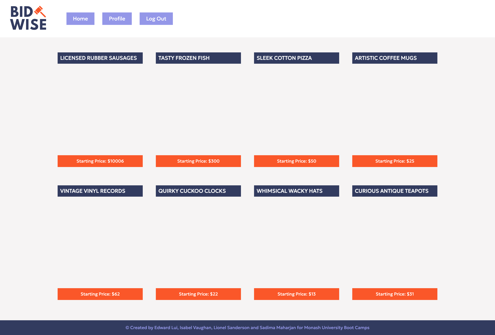
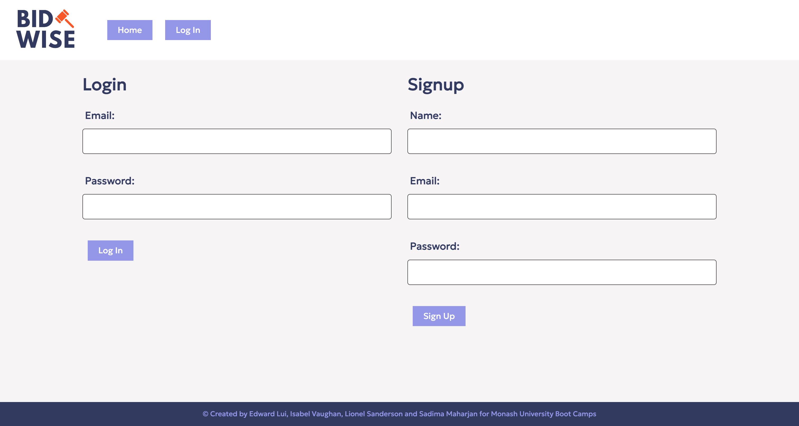
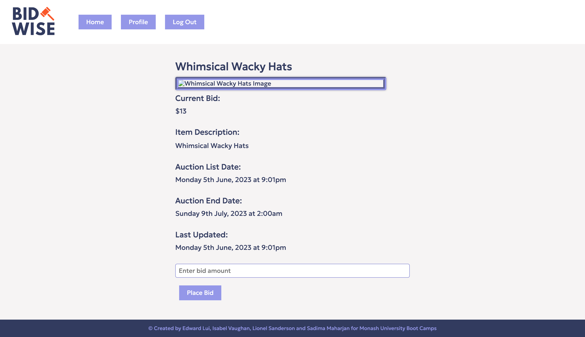
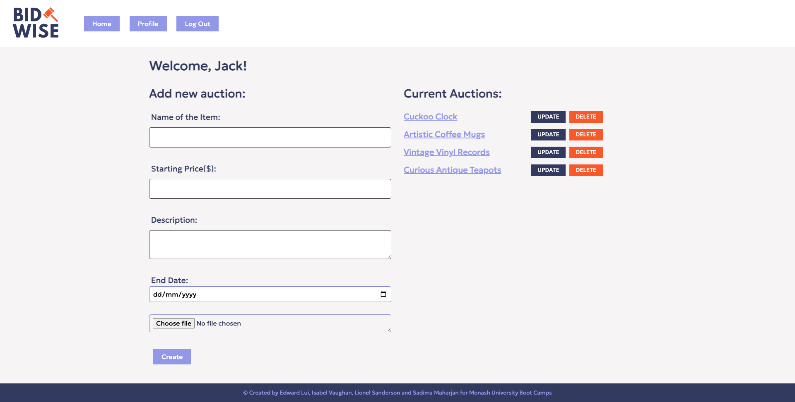

# BidWise: Interactive Full-Stack Application

## Description

BidWise is a comprehensive desktop and mobile application designed to provide users with a platform to engage in online auctions, view and bid on a wide range of items, as well as create their own auctions to sell their preloved goods. The app offers a convenient and user-friendly interface that facilitates the buying and selling process.

Here are some key features and benefits of using BidWise:

1. Auction Listings: BidWise enables users to explore a vast array of auction listings. Users can browse through the available items, view detailed descriptions, and images to make informed bidding decisions.

2. Bidding and Auction Management: Users can place bids on items they are interested in.

3. Auction Creation: BidWise allows users to create their own auctions and sell their preloved goods. Users can set the starting bid, duration of the auction, and provide detailed information about the item they are selling. They can also upload an image to showcase the item's condition.

## Technologies Used

- Node.js
- Express.js
- Handlebars.js
- MySQL
- Sequelize ORM
- Express-session
- Cookies
- Faker.js
- Google API

## Installation

1. Clone the repository.
2. Install dependencies using run `npm install`.
3. Configure the environment variables using the `.env.EXAMPLE` file.
4. Set up the database by running `npm run createdb`, `npm run createtables` and `npm run seed`
5. Start the application using `npm start`.

To set up the Google Search API and environment variables, refer to these steps:
1. Create a Google Cloud Platform (GCP) project: If you don't already have a GCP project, create one by visiting the Google Cloud Console (console.cloud.google.com) and following the instructions.
2. Enable the Google Search API: Once you have a GCP project, navigate to the Google Cloud Console and search for the Google Search API. Enable it for your project.
3. In the Cloud Console, navigate to the "IAM & Admin" section or search for "IAM & Admin" in the search bar.
4. Click on "Service accounts" to access the service accounts dashboard.
5. Click on the "Create Service Account" button to create a new service account.
6. Provide a name and ID for the service account, and optionally add a description.
7. Choose the appropriate project role(s) for the service account. The roles determine the permissions and access levels the service account will have.
8. Optionally, grant any necessary additional permissions by clicking on "Add another role."
9. Enable the "Furnish a new private key" option and select the key type as "JSON."
10. Click on the "Create" button to create the service account and generate a JSON credentials file.
11. The JSON file will be automatically downloaded to your computer. Store this file securely, as it contains sensitive information that grants access to your Google Cloud resources.
12. Refer to the .env.example file and copy over the respective attribute values from the downloaded JSON credentials file into your own .env file
13. Set up database credentials in the .env file

## Demo

[Link to the deployed application](https://your-app-url.com)

[Link to the GitHub repository](https://github.com/isabelkvaughan/BidWise)

## Mock Up

- BidWise Home Page
  
- Login / Sign Up
  
- Auction Item
  
- User Profile
  

## Contributors

- Edward Lui
- Sadima Maharjan
- Lionel Sanderson
- Isabel Vaughan
